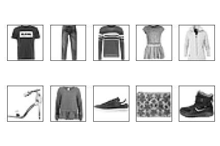
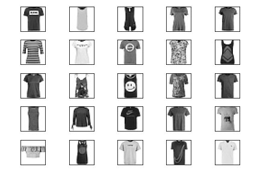
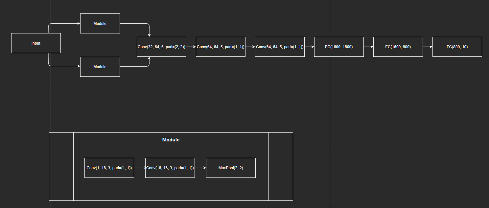

# Introduction
**Fashion-MNIST** is a dataset of Zalando's article images. The dataset is divided into two parts:
- Training set consisting of 60000 images
- Test set consisting of 10000 images

<a/>

Here is an example of how the data looks like: 
 

The images are all greyscale and centered. Each training and test sample is assigned to one of following labels: 
<table>
 <tr>
  <th>Labels</th>
  <th>Descriptions</th>
 </tr>
 
 <tr>
  <td>0</td>
  <td>T-shirt</td>
 </tr>
 
 <tr>
  <td>1</td>
  <td>Trouser</td>
 </tr>
 
 <tr>
  <td>2</td>
  <td>Pullover</td>
 </tr>
 
 <tr>
  <td>3</td>
  <td>Dress</td>
 </tr>
 
 <tr>
  <td>4</td>
  <td>Coat</td>
 </tr>
 
 <tr>
  <td>5</td>
  <td>Sandal</td>
 </tr>
 
 <tr>
  <td>6</td>
  <td>Shirt</td>
 </tr>
 
 <tr>
  <td>7</td>
  <td>Sneaker</td>
 </tr>
 
 <tr>
  <td>8</td>
  <td>Bag</td>
 </tr>
 
 <tr>
  <td>9</td>
  <td>Ankle boot</td>
 </tr>
</table>

# Methods
### Preprocessing
I have normalized images for following classificators:
- Logistic Regression
- 2 Conv + 2 Pool Convolutional Neural Network **(CNN)**
- 2 Conv + 2 Pool CNN with Batch Normalization
- 2 Conv + 2 Pool + 3 FC CNN with Batch Normalization

For the following classificators I haven't preprocessed images:
- 2 Conv -> Pool -> 2 Conv -> Pool -> 3 FC CNN with Batch Normalization
- 2 Conv -> Pool -> Concat -> 3 Conv -> Pool -> 3 FC CNN with Batch Normalization

where: 
Conv - Convolutional layer 
Pool - Maximum pooling layer 
Concat - concatenation of two parallel modules of the same structure 
FC - fully connected layer 

### Logistic Regression 
The first model I have tested was **Logistic Regression** implemented in *scikit-learn*. The **Logistic Regression** is a linear model. 
In the multiclass problem it uses one-vs-rest scheme. The model uses L2 regularization. I have performed grid search with cross-validation on the model
to find the best set of hyper-parameter.  
These are: 
C: 0.1 
fit_intercept: False 
The rest of parameters have default value.  
I have performed normalization of images and I have experimented with *Principal Component Analysis (PCA)*. Due to the nature of the problem,
reducing dimensionality didn't provide good results. Therefore in the end I have decided not to use *PCA*. 

### Convolutional Neural Network 
**CNNs** have become state-of-the-art computer vision technique. Among many kind of Neural Networks, these have proved to be very successful in image classification
with reasonable computational cost. 

I have experimented with several kinds of their architectures. Besides *Convolutional Layers* and *Fully Connected Layers* I have decided to use
*Batch Normalization* in every single one of them. I have tried both *Average Pooling* and *Maximum Pooling* and both have been effective.
I have also choosen to use *ReLU* activation function in all cases. 

*Batch Normalization* has proven to greatly increase training speed, while also improving CNNs ability to fit to the data.
*Max Pooling* extracts the stronges features from the feature map. In Fashion-MNIST images, edges seem to be the most important features.
Therefore *Max Pooling* is a reasonable choice. However *Average Pooling* has proved to be effective too, I suppose it's because the images are clear with no blurr. 

*ReLU* activation function provides non-linearity while eliminating vanishig gradient problem. Since most of the CNNs weren't shallow, sigmoidal activation functions
didn't provide good results. 

For the loss function I have chosen *CrossEntropyLoss*, because it perfmorms well in most cases. As optimizer I have chosen Adam optimization algorithm, which is and improved
stochastic gradient descent. I have divided the data set into minibatches, each in size of 16.

#### References
**Batch Normalization** 
Ioffe, Sergey, and Christian Szegedy. "Batch normalization: Accelerating deep network training by reducing internal covariate shift." International conference on machine learning. PMLR, 2015.

**Inspirations for CNNs architectures** 
https://towardsdatascience.com/illustrated-10-cnn-architectures-95d78ace614d?fbclid=IwAR3jPDP_7dxDurCnPmhXPK7fRlS3Vp5qM9pKri13CNufvOQjyL0spQaHQtM

**General machine learning knowledge and Logistic Regression** 
Sebastian Raschka, Vahid Mirjalili Python, Machine Learning 2019

**Guide on direction of parameter choices for CNN layers** 
https://towardsdatascience.com/a-guide-to-an-efficient-way-to-build-neural-network-architectures-part-ii-hyper-parameter-42efca01e5d7

#### The best model architecture

Above model firtly performs double convolution with max pooling on the input two times. It uses padding to keep feature maps sizes unchanged, 
due to the importance of edges of the images. Then the CNN performs convolution three times increasing channels number to 64 with pooling at the end to reduce dimentionality.
The images are flattened and pushed to three fully connected layers which furthermore try to find patterns in the data.

# Results
<table>
 <tr>
  <th>Classifier</th>
  <th>Preprocessing</th>
  <th>Accuracy</th>
  <th>F1-Score</th>
  <th>Reference Accuracy</th>
  <th>Reference Link</th>
 </tr>
 <tr>
  <td>Logistic Regression</td>
  <td>Normalization</td>
  <td>92.16%</td>
  <td>84.31%</td>
  <td>84.00%</td>
  <td><a href="http://fashion-mnist.s3-website.eu-central-1.amazonaws.com">Link</a></td>
 </tr>
 <tr>
  <td>2 Conv + MaxPool</td>
  <td>Normalization</td>
  <td>87.75%</td>
  <td>87.72%</td>
  <td>91.16%</td>
  <td><a href="https://github.com/zalandoresearch/fashion-mnist/blob/master/benchmark/convnet.py">Link</a></td>
 </tr>
 <tr>
  <td>2 Conv + MaxPool + Batch Norm</td>
  <td>Normalization</td>
  <td>90.07%</td>
  <td>90.13%</td>
  <td>93.40%</td>
  <td><a href="https://github.com/khanguyen1207/My-Machine-Learning-Corner/blob/master/Zalando%20MNIST/fashion.ipynb">Link</a></td>
 </tr>
 <tr>
  <td>2 Conv + MaxPool + 3 FC + Batch Norm</td>
  <td>Normalization</td>
  <td>90.69%</td>
  <td>90.67%</td>
  <td>93.40%</td>
  <td><a href="https://github.com/cmasch/zalando-fashion-mnist">Link</a></td>
 </tr>
 <tr>
  <td>2 Conv + MaxPool + 2 Conv + MaxPool + 3 FC + Batch Norm</td>
  <td>None</td>
  <td>92.20%</td>
  <td>92.12%</td>
  <td>93.50%</td>
  <td><a href="https://github.com/QuantumLiu/fashion-mnist-demo-by-Keras">Link</a></td>
 </tr>
 <tr>
  <td>2 Conv + AvgPool + 2 Conv + AvgPool + 3 FC + Batch Norm</td>
  <td>None</td>
  <td>92.43%</td>
  <td>92.42%</td>
  <td>None</td>
  <td>None</td>
 </tr>
 <tr>
  <td>2 Conv + MaxPool + 2 Conv + MaxPool + 3 FC + Batch Norm (Edge emphasis)</td>
  <td>None</td>
  <td>92.30%</td>
  <td>92.28%</td>
  <td>None</td>
  <td>None</td>
 </tr>
 <tr>
  <td>2*(2 Conv + MaxPool) + 3 Conv + MaxPool + 3 FC + Batch Norm</td>
  <td>None</td>
  <td>92.48%</td>
  <td>92.51%</td>
  <td>None</td>
  <td>None</td>
 </tr>
</table>

For Logistic Regression I have achieved similar results to the ones presented on benchmark. I suppose its because the model is nothing extraordinary and implemented in similar
way to the ones on benchmark. For most CNN approaches I have achieved similar or slightly worse results. The reasons are probably slighly diffrent architecture and parameters of layers. My conclusion is that, the deeper the network became the better results it provided, therefore usage of a deep convolutional network could give the best results.

# Usage
If you don't have Anaconda install it following offical guide: 
https://docs.anaconda.com/anaconda/install/index.html

If you don't have git you can either install it and clone this repository or download code as zip: 
https://git-scm.com/book/en/v2/Getting-Started-Installing-Git

1. Open Anaconda.
2. Move to the folder with my repository code.
3. Create a virtual enviroment with `conda create --name name_of_env --file requirements.txt`
4. Activate a virtual enviroment with `conda activate name_of_env`
5. Open Jupyter Lab with `jupyter lab`. Make sure you are in a parent folder of downloaded repository.
6. Move to the MSiD-4 folder.
7. Open MSiD-Zadanie4.ipynb
8. You can run the code with one click on button on the upper side of notebok: "Restart the kernel, and re-run the whole notebook".
9. The data is downloaded automatically by PyTorch to data folder.
10. In section Convolutional Neural Network Model -> Model Evalutaion you can load several saved pre-trained models to check their accuracy running the cell below.
